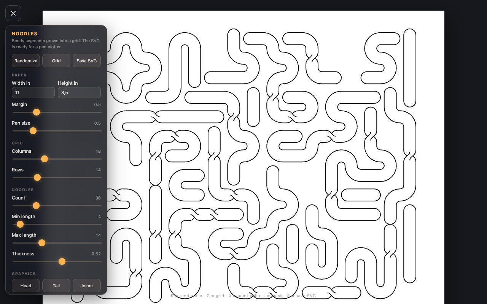

# generative-noodles

Bendy noodle segments grown into a grid, drawn as SVG for pen plotters. Runs in the
browser, no build step and no dependencies.

A web rewrite of [cadin/generative-noodles](https://github.com/cadin/generative-noodles)
by [Cadin Batrack](https://github.com/cadin), which is a Processing sketch. Same idea,
without Processing. All credit for the concept goes there.

## Usage

Open `index.html` in a browser, or use the hosted version.

**`R`** randomize · **`G`** toggle the grid · **`X`** paint blocked cells ·
**`I`** load a mask image · **`S`** save an SVG · **`H`** toggle the panel

Every drawing comes from a seed. Type a seed back into the panel and the same noodles
return, so a plot you liked is never lost. The saved SVG carries its real paper size in
inches, so a plotter or a print dialog picks up the right dimensions without scaling,
and all settings ride along in a comment at the top of the file.

## Blocking cells

Noodles avoid blocked cells, which is how you shape the drawing. Press **`X`** and
paint them with the mouse; drag to paint a run of cells, drag again over a blocked
cell to clear it. The layout regrows from the same seed when you let go.

A mask image does the same thing from a picture: **`I`** loads one, scales it to fit
the grid, and blocks every cell sitting over a dark pixel. Space left over by a
mismatched aspect ratio counts as blocked. Change the grid size and the mask is
reapplied by itself. Painting by hand from then on drops the mask.

Blocked cells and the grid are drawing aids and never end up in the saved SVG.

## Graphics

Ends and straight sections can carry your own SVG shapes. Load them in the Graphics
row: **Head** is the end cap, **Tail** the other end if it should differ, **Joiner** a
piece that drops into straight sections. The Joiners slider sets how often that
happens; with the slider up and no file loaded you get the twist from the original
sketch.

Draw the graphic on a square viewBox, vertically, with the noodle edges running down
the left and right sides and the connection along the bottom edge. A joiner connects
on both the top and the bottom. That is the same convention as the original, so its
graphics work here unchanged.

Where a graphic sits, the outline is cut open and the shape carries the line across.

## How it works

Noodles are self-avoiding walks over a grid: pick a free cell, grow into a random free
neighbour, and when the head gets stuck, keep growing from the tail instead. The random
numbers come from a seeded generator, which is what makes a drawing reproducible.

The grid keeps every turn at 90 degrees, so the outline needs no offset curve maths.
A straight cell is two parallel lines, a corner is two concentric quarter arcs whose
radii are the cell half-width plus or minus half the noodle width, and each end is a
half-circle cap flush with the outer cell edge. That makes one closed path per noodle,
which a graphic then cuts open where it sits.

Open `index.html?test=1` to run the geometry self check; the result lands in the
page title.

## Not built yet

Overlapping noodles and the path edit mode from the original.

## License

MIT, see [LICENSE](LICENSE). The original Processing sketch by Cadin Batrack is
released under the Unlicense.
